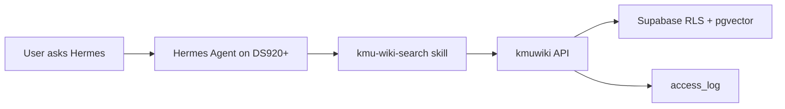

# Hermes DS920+ PoC Implementation Plan

This PoC adds Hermes Agent as an orchestration layer for kmuwiki search. It does
not replace the current search stack. Supabase RLS, masked chunks, hybrid
pgvector search, rerank, and access logging remain owned by kmuwiki.

Hermes may sign in through Supabase Auth as a dedicated limited user. It must
not receive a Supabase service-role key and must not query Supabase tables
directly.

## What Was Added

- `deploy/hermes/docker-compose.yml`: DS920+ Docker service for
  `nousresearch/hermes-agent`.
- `deploy/hermes/VERSION`: deployment script version marker shown in logs.
- `deploy/hermes/.env.example`: runtime settings and secret placeholders.
- `deploy/hermes/start-hermes.sh`: prepares the Docker volume, syncs the skill,
  and starts the gateway.
- `deploy/hermes/check-hermes.sh`: Hermes health/API diagnostic.
- `deploy/hermes/wait-hermes-api.sh`: waits for API readiness after recreation.
- `deploy/hermes/test-hermes-skills.sh`: confirms Hermes API sees
  `kmu-wiki-search`.
- `deploy/hermes/test-hermes-chat.sh`: optional `/v1/chat/completions` smoke
  test for the registered skill path.
- `deploy/hermes/test-kmuwiki.sh`: kmuwiki helper smoke test.
- `deploy/hermes/test-kmuwiki-workflow.sh`: search plus recurring-work workflow
  smoke test.
- `deploy/hermes/verify-hermes.sh`: full operational check.
- `deploy/hermes/final-check-hermes.sh`: final check that runs verification
  with the optional chat-completions smoke test enabled.
- `deploy/hermes/status-hermes.sh`: summarizes verification logs without
  printing secrets.
- `deploy/hermes/cleanup-hermes-root.sh`: dry-run-first cleanup for old root
  artifacts.
- `deploy/hermes/access-log-check.sql`: Supabase SQL Editor query for verifying
  recent audit rows for the dedicated Hermes account.
- `deploy/hermes/skills/kmuwiki/kmu-wiki-search/SKILL.md`: Hermes skill
  instructions.
- `deploy/hermes/skills/kmuwiki/kmu-wiki-search/scripts/kmuwiki_api.py`: stdlib
  helper for `/search`, `/hermes`, `/reports`, and `workflow`.
- `ingest/kmu_query/service.py`: retrieval filters accept `source_year` so
  Hermes can search source-year documents while preparing target-year drafts.

## Runtime Flow



## Skill Discovery

The DS920+ container mounts the repository skill at `/opt/data/skills/kmuwiki`
as a read-only source. During startup, `start-hermes.sh` syncs that skill into
`/opt/data/skills/kmu-wiki-search` inside the Docker volume.

This is the canonical discovery path because the container sets
`HERMES_HOME=/opt/data`, and Hermes scans `HERMES_HOME/skills`.

A compatibility copy is also written to
`/opt/data/home/.hermes/skills/kmu-wiki-search` for diagnostics and older
profile-home assumptions.

## DS920+ Deployment

Run on the NAS through SSH, DSM Task Scheduler, or the DSM terminal:

```sh
export HOME=/root
cd /volume1/jdh/repo/deploy/hermes
sh start-hermes.sh
```

If `.env` does not exist, `start-hermes.sh` creates it and exits. Edit
`/volume1/jdh/repo/deploy/hermes/.env`, then run `sh start-hermes.sh` again.

Required `.env` values:

- `API_SERVER_KEY`: strong bearer token for the Hermes API server.
- `KMUWIKI_API_BASE_URL`: `https://<app>/api`, `https://<app>/rag`, or
  `http://<rag-host>:8000`.
- `NEXT_PUBLIC_SUPABASE_URL` and `NEXT_PUBLIC_SUPABASE_ANON_KEY`: public
  Supabase project values used for Auth login.
- `KMUWIKI_AUTH_EMAIL` and `KMUWIKI_AUTH_PASSWORD`: dedicated limited kmuwiki
  account credentials.
- `KMUWIKI_AUTH_TOKEN`: optional manual user JWT override for one-off tests.
- `KMUWIKI_API_SECRET`: optional direct RAG shared secret.
- `OPENROUTER_API_KEY` or `OPENAI_API_KEY`: optional for direct search/workflow
  tests, but required for the final Hermes `/v1/chat/completions` smoke test.

## Dedicated Account Setup

Use a normal Supabase Auth user instead of a service key, for example:

```text
hermes-agent@kmu.local
```

Give it only the department rows it should search:

```sql
insert into access_roles (user_id, dept, role)
select id, '<department-name>', 'staff'
from auth.users
where email = 'hermes-agent@kmu.local'
on conflict (user_id, dept)
do update set role = excluded.role;
```

Add one `access_roles` row per allowed department. Do not put
`SUPABASE_SERVICE_ROLE_KEY` in the Hermes `.env`.

## PoC Commands

Full operational check:

```sh
export HOME=/root
cd /volume1/jdh/repo/deploy/hermes
HERMES_FORCE_RECREATE=1 sh verify-hermes.sh
sh status-hermes.sh
```

Final check with chat-completions smoke test:

```sh
export HOME=/root
cd /volume1/jdh/repo/deploy/hermes
sh final-check-hermes.sh
```

From Windows PowerShell, if SSH is enabled on the NAS:

```powershell
Y:\repo\deploy\hermes\run-final-check-from-windows.ps1
```

You may be prompted twice: once for SSH login and once for `sudo`, because
Docker on Synology usually requires root privileges.

For a double-click-friendly wrapper:

```powershell
Y:\repo\deploy\hermes\run-final-check-from-windows.cmd
```

For DSM Task Scheduler, use:

```text
Y:\repo\deploy\hermes\RUN_FINAL_CHECK_DSM_TASK.txt
```

Health/API check:

```sh
sh check-hermes.sh
```

Skill discovery check:

```sh
sh test-hermes-skills.sh
```

kmuwiki smoke tests:

```sh
sh test-kmuwiki.sh
sh test-kmuwiki-workflow.sh
```

Optional Hermes chat completion test:

```sh
HERMES_RUN_CHAT_TEST=1 sh verify-hermes.sh
sh status-hermes.sh
```

This calls `/v1/chat/completions` and may use the configured upstream LLM.
If it fails with `FAILED_NO_INFERENCE_PROVIDER`, add an inference provider key
such as `OPENROUTER_API_KEY` or `OPENAI_API_KEY` to the NAS `.env`, then rerun
the final check.

The final check skips image pull by default (`HERMES_SKIP_PULL=1`) and forces one
container recreation so updated `.env` provider keys are copied into the Hermes
data volume.

The final check syncs whitelisted `.env` values into `/opt/data/.env` and
`/opt/data/home/.hermes/.env` inside the running container, then restarts the
container before verification. This avoids the slow one-off preparation
container path.

Inside the Hermes container:

```sh
python /opt/data/skills/kmuwiki/kmu-wiki-search/scripts/kmuwiki_api.py workflow \
  --query "exchange student promotion recurring work" \
  --source-year 2026 \
  --target-year 2027 \
  --k 12
```

In Hermes chat:

```text
Use the kmu-wiki-search skill to find 2026 exchange student promotion work and prepare 2027 draft candidates.
```

## Security Checks

- Hermes does not mount `/volume1/jdh/kmuwiki/01_raw`.
- Hermes does not receive `SUPABASE_SERVICE_ROLE_KEY`.
- Hermes only uses Supabase Auth login for the dedicated limited account.
- Port `8642` binds to `127.0.0.1` by default.
- Direct browser CORS is disabled by default.
- All document access goes through a user JWT and the existing kmuwiki API.

## Completion Criteria

The PoC is ready when:

1. `sh verify-hermes.sh` records `start-hermes=0`.
2. `sh check-hermes.sh` records successful Hermes API responses.
3. `sh test-hermes-skills.sh` records `SKILL_CHECK=FOUND`.
4. `sh test-kmuwiki.sh` returns kmuwiki search JSON with `EXIT_CODE=0`.
5. `sh test-kmuwiki-workflow.sh` records `WORKFLOW_CHECK=FOUND_KEYS`.
6. `sh final-check-hermes.sh` or `HERMES_RUN_CHAT_TEST=1 sh verify-hermes.sh` records
   `test-hermes-chat=0` and `CHAT_CHECK=FOUND_EVIDENCE_RESPONSE`.
7. Running `deploy/hermes/access-log-check.sql` in the Supabase SQL Editor
   shows recent rows for `hermes-agent@kmu.local`.
